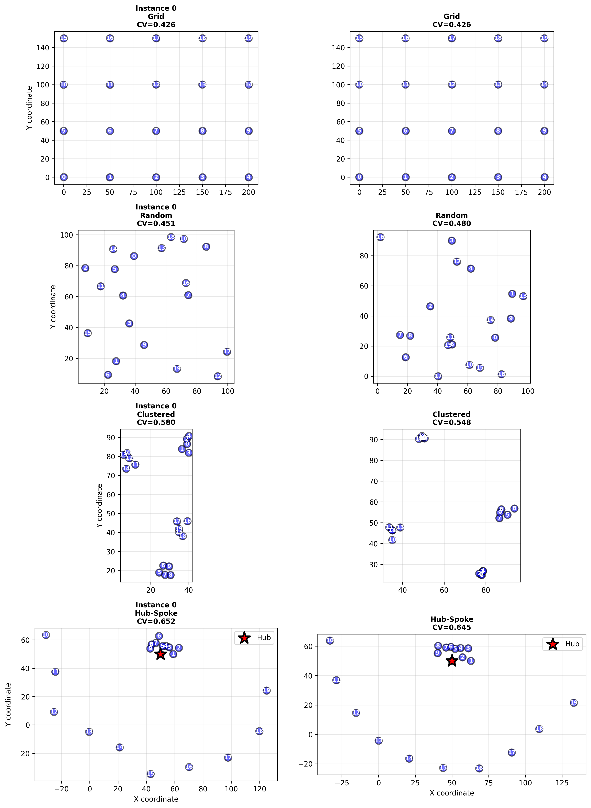
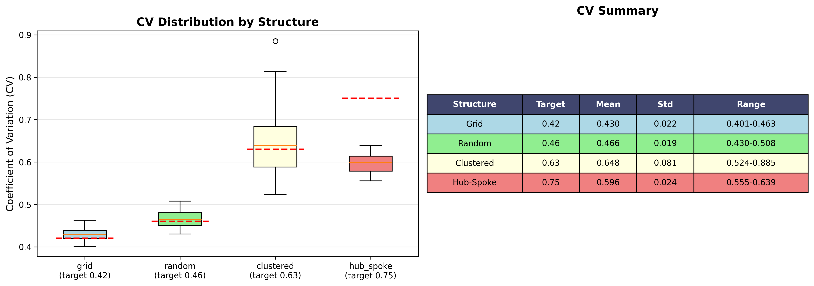

# TSP Integrality Gap Analysis Project

## Overview
This project investigates the cost of the convexity problem in the Traveling Salesman Problem (TSP) by analyzing the interaction between mathematical formulations and cost structures.  
Test data is generated using `data_generation.py`.

The main focus is on the **integrality gap**: the difference between the optimal integer programming (IP) solution and the optimal linear programming (LP) relaxation solution for various TSP formulations and cost structures.

We use 4 types of structures: Grid City, Random Euclidean, Clustered and Hub-and-Spoke. You can see what does this mean in the graph below.

**Example destination distributions:**


Each structure may imply different CV (Coefficient of Variation), you can see the distribution of CV of each structure type we use during the test.

**CV for each data type:**


## How to run the program
1. **Create a Python virtual environment (recommended):**
   ```bash
   python3 -m venv .venv
   source .venv/bin/activate
   ```

2. **Install required packages:**
   ```bash
   pip install -r requirements.txt
   ```

3. **Generate test data and graphs:**
   ```bash
   python data_generation.py
   ```

After running, you will find:
- **CSV files** containing test data in the `data/` directory.
- **Graphs** showing CV for each structure type and 2 examples of each structure in the `graphs/` directory.

## How to run the models and generate benchmark data for IP and LP

Run the following scripts to generate results for each TSP formulation:

```bash
python run_dfj_with_testdata.py   # DFJ formulation
python run_gg_with_testdata.py    # Gavish-Graves formulation
python run_mtz_with_testdata.py   # MTZ formulation
```
For assignment problem, it takes really long to run (more than 9000 minutes), we discourage you to try on it. You can just believe us that the result would be similar to our run in `results/assignment_results.csv`

All other methods' results will be produced and in the `results/` folder for further analysis and visualization.

## How to analyse the results with notebook
You should now be able to use `analyze_results.ipynb` to see the final result. Knowing that local Gurabi struggle to solve assignment problem for n=18 and n=20 our final result is actually using n=15 for most of the benchmarks cross algorithms.
